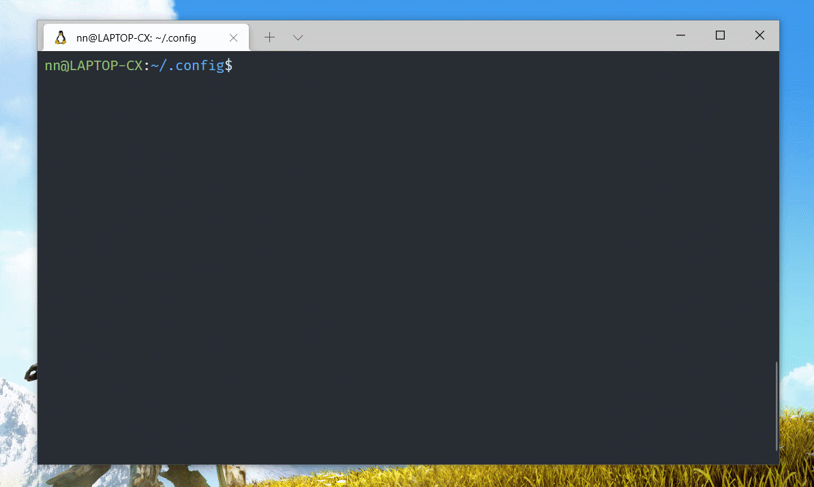
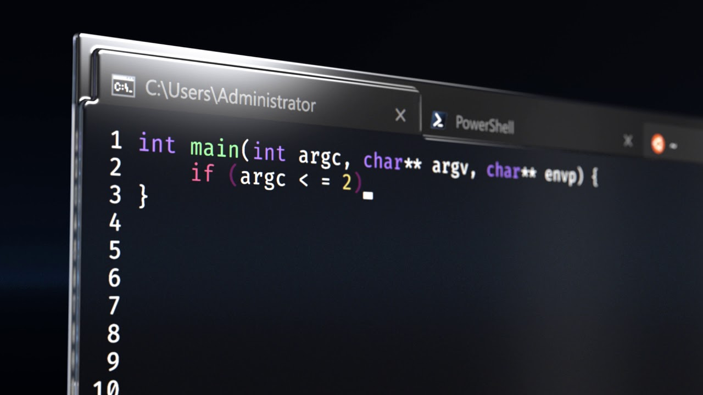
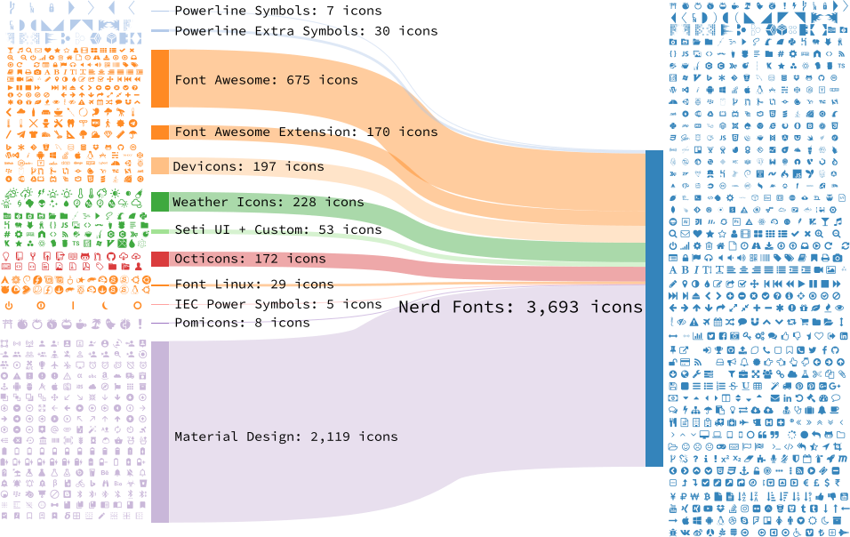
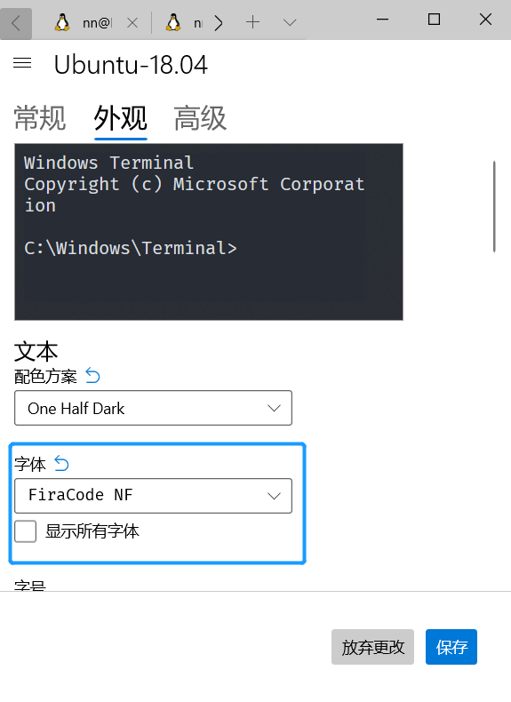
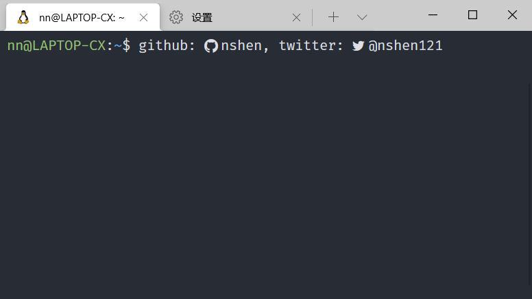

# learn-neovim-lua

本人常年在 `Windows` 机器上做 `Web` 开发，虽然已经使用 “`VIM`” 好多年了，但都是在使用 [VSCodeVim](https://github.com/VSCodeVim/Vim)

可以说我的 `VIM` 指法都是在 `VSCode` 上练会的。 中间曾尝试配置过几次原生的 `VIM`，包括各种 GUI 的版本，最终都放弃了。

主要原因当然是 `VSCode` 实在是太强大了，应用商店有各种插件，涵盖 Web 开发的方方面面，装上基本不用配置就非常非常好用了。
早期 `VSCode` 上的有好几个 vim 相关的插件，各有各的 bug。但后期 [VSCodeVim](https://github.com/VSCodeVim/Vim) 被收编后就统一了，
有了微软的投入也变的足够好用了。最主要的是，我可以混用 `VIM` 的快捷键和 `VSCode` 的原生功能，比如 `Ctrl+p` `Ctrl+Shift+p` 等。

而 `VIM` 这边太原始，配置太硬核了，要在 `vimrc` 里写一堆看不懂的配置才能满足基本使用。费大劲配置出来效果还也不如 `VSCode`。
除了在服务器上开发，在本地根本没有任何优势。

但状况随着时间的推移有了新变化，随着 [WSL 2](https://docs.microsoft.com/en-us/windows/wsl/) 和 [Windows Terminal](https://www.microsoft.com/zh-cn/p/windows-terminal)
的推出，Windows 命令行也有了 Unicode、和 UTF-8 字符支持，GPU 加速文本渲染引擎等支持。

而 [Neovim](https://github.com/neovim/neovim) 0.5.x 正式版推出后，内置了 LSP（稍后介绍），
`Lua` 成了编辑器的一等语言，众多 `VIM` 插件都有了 `Lua` 原生版本，配置也没有那么硬核了，突然使得 `Vim` 更加现代化了，也更好用了。

反而 `VSCode` 这边不断的加我用不到的功能，感觉越来越慢了，最烦的是 VSCode 并不能完全的脱离鼠标，总有不得不用鼠标去点的按钮。

所以我又一次尝试了逃离 `VSCode`，使用下来，目前感觉良好，常用的功能都没问题，而且可以完全脱离鼠标了。

本文介绍一下我如何在 `Windows` 命令行环境下配置 `Neovim`，以及各种常用插件的配置和使用方法。

先看运行效果



## 目录

- WSL 2
- Windows Terminal
- Nerd fonts
- 安装 Neovim
- Neovim 配置文件
- 配置入口 init.vim 
- 基础配置 basic.lua 
- 快捷键配置 keybindings.lua
- 插件管理器 Packer
- 语法高亮 Treesitter
- LSP

## WSL 2

首先确定你的 `Windows` 系统是否为 `WSL 2`，如果不是请先找教程升级到 `WSL2`

查看方法为在 `cmd` 中运行 `wls -l -v`


可以看到我安装的子系统为 `Ubuntu-18.04`，后边的 `VERSION` 2 表示是在 `WSL2` 环境，继续。

## Windows Terminal

在 [微软应用商店](https://www.microsoft.com/en-us/p/windows-terminal/9n0dx20hk701?activetab=pivot:overviewtab#) 直接点击 Get 安装



安装后可以在 `设置` 里进行一系列美化设置，之后最重要的是安装 `Nerd fonts`。

## Nerd fonts

简单讲，Nerd fonts 就是打包了各种常见的 ‘iconic fonts’，到你常用的字体里。

这样就可以方便的在命令行下显示这些 icons 了。 很多插件都会用到这些图标



到这里 https://www.nerdfonts.com/font-downloads 找到你喜欢的字体。

比如我最常用的是 `Fira Code` 字体，我安装这个

https://github.com/ryanoasis/nerd-fonts/tree/master/patched-fonts/FiraCode/Regular/complete/

注意要下载兼容 `Windows` 的版本 `XXXX Windows Compatible.ttf`

到 `设置` `外观` 里，选中刚才安装的字体，保存。



安装过后，命令行里就支持显示这些小图标了，到这个网址可以复制小图标

https://www.nerdfonts.com/cheat-sheet

到命令行里粘贴。



## 安装 Neovim

由于我的环境的 `Ubuntu-18.04` ，所以要用 `apt` 安装 `Neovim`，具体方法如下：

```bash
sudo add-aptrepository ppa:neovim-ppa/stable
sudo apt-get update
sudo apt-get install neovim
```

## Neovim 配置文件

Neovim 配置文件不是 `.vimrc`

而是

`~/.config/nvim/init.vim`

也可以直接是 `init.lua` ，为了保证和老版本兼容，或者有一些不知怎么在 `lua` 下配置的，我还是使用 `init.vim`

从 `init.vim` 里调用 `lua`，可以这样

```
lua print('单行 lua')
```

多行调用

```
lua <<EOF
print('多行 lua')
print('多行 lua')
EOF
```

在 `Neovim` 中加载 `lua` 文件，可以这样

```
" 加载 lua/basic.lua 文件，此行为注释
lua require('basic')
```

目前我的配置文件大概是这个样子。

```
├── init.vim                              入口文件
└── lua                                   所有 lua 配置文件
    ├── basic.lua                         Neovim 的基础配置
    ├── keybindings.lua                   快捷键配置
    ├── lsp                               内置 LSP  (Language Server Protocol) 配置
    │   ├── diagnostic_signs.lua
    │   ├── language_servers.lua
    │   └── nvim-cmp-config.lua
    ├── plugin-config                     各个插件配置在这个文件夹
    │   ├── bufferline.lua
    │   ├── comment.lua
    │   ├── nvim-autopairs.lua
    │   ├── nvim-colorizer.lua
    │   ├── nvim-tree.lua
    │   ├── nvim-treesitter.lua
    │   ├── rust-tools.lua
    │   ├── surround.lua
    │   ├── telescope.lua
    │   └── which-key.lua
    └── plugins.lua                       插件安装管理
```

## init.vim 配置入口

`init.vim` 是入口文件，主要负责加载各个 lua 文件，对应上边的结构。

如果暂时没有找到办法用lua设置的，就在这里用vim脚本设置。

```
" 基础设置
lua require('basic')
" Packer插件管理
lua require('plugins')
" 快捷键映射
lua require('keybindings')
" 皮肤设置
" https://github.com/ellisonleao/gruvbox.nvim
set background=dark " or light if you want light mode
colorscheme gruvbox

" 插件配置
lua require('plugin-config/which-key')
lua require('plugin-config/nvim-treesitter')
lua require('plugin-config/telescope')
lua require('plugin-config/nvim-autopairs')
lua require('plugin-config/nvim-tree')
lua require('plugin-config/bufferline')
lua require('plugin-config/surround')
lua require('plugin-config/comment')
lua require('plugin-config/nvim-colorizer')
lua require('plugin-config/rust-tools')

" lsp
lua require('lsp/nvim-cmp-config')
lua require('lsp/diagnostic_signs')
lua require('lsp/language_servers')
```

## 基础配置 basic.lua

这里的配置看着有点多，比 `VSCode` 复杂多了，主要是历史遗留的默认配置不太合理。

其实不用纠结太多，我参考了很多大神的配置都差不多，可以闭眼直接 copy。

可以根据需要微调，大部分都有注释

```lua
-- utf8
vim.g.encoding = "UTF-8"
vim.o.fileencoding = 'utf-8'
-- 光标下方保留8行
vim.o.scrolloff = 8
vim.o.sidescrolloff = 5
-- 相对行号
vim.wo.number = true
vim.wo.relativenumber = true
-- 高亮所在行
vim.wo.cursorline = true
-- 显示左侧图标指示列
vim.wo.signcolumn = "yes"
-- 右侧参考线
vim.wo.colorcolumn = "80"
-- 缩进2个空格等于一个Tab
vim.o.tabstop = 2
vim.bo.tabstop = 2
vim.o.softtabstop = 2
vim.o.shiftround = true
-- >> << 时长度
vim.o.shiftwidth = 2
vim.bo.shiftwidth = 2
-- 新行对齐当前行，空格替代tab
vim.o.expandtab = true
vim.bo.expandtab = true
vim.o.autoindent = true
vim.bo.autoindent = true
vim.o.smartindent = true
-- 搜索大小写不敏感，除非包含大写
vim.o.ignorecase = true
vim.o.smartcase = true
-- 搜索不要高亮
vim.o.hlsearch = false
-- 边输入边搜索
vim.o.incsearch = true
-- 使用增强状态栏后不再需要 vim 的模式提示
vim.o.showmode = false
-- 命令行高为2，提供足够的显示空间
vim.o.cmdheight = 2
-- 当文件被外部程序修改时，自动加载
vim.o.autoread = true
vim.bo.autoread = true
-- 禁止折行
vim.o.wrap = false
vim.wo.wrap = false
-- 允许隐藏被修改过的buffer
vim.o.hidden = true
-- 鼠标支持
vim.o.mouse = "a"
-- 行结尾可以跳到下一行
vim.o.whichwrap = 'b,s,<,>,[,],h,l'
-- 禁止创建备份文件
vim.o.backup = false
vim.o.writebackup = false
vim.o.swapfile = false
-- smaller updatetime 
vim.o.updatetime = 300
-- 等待mappings
vim.o.timeoutlen = 100
-- split window 从下边和右边出现
vim.o.splitbelow = true
vim.o.splitright = true
-- 自动补全不自动选中
vim.g.completeopt = "menu,menuone,noselect,noinsert"
---------------------------------------------
vim.o.background = "dark"
vim.o.termguicolors = true
vim.opt.termguicolors = true
--? tab 字符显示
vim.o.list = true
vim.o.listchars = "tab:>·"
-- 补全
vim.o.wildmenu = true
-- Dont' pass messages to |ins-completin menu|
vim.o.shortmess = vim.o.shortmess .. 'c'
vim.o.pumheight = 10
-- vim.o.conceallevel = 0
vim.o.showtabline = 2

```

## 快捷键配置 keybindings.lua

```lua

-- leader
vim.g.mapleader = " "
vim.g.maplocalleader = " "
local map = vim.api.nvim_set_keymap


-- ctrl u / ctrl + d  只移动9行，默认移动半屏
map("n", "<C-u>", "9k", {noremap = true, silent = true })
map("n", "<C-d>", "9j", {noremap = true, silent = true })

map('v', '<', '<gv', {noremap = true, silent = false})
map('v', '>', '>gv', {noremap = true, silent = false})

-- 分屏
map("n", "<A-h>", "<C-w>h", {noremap = true, silent = false })
map("n", "<A-j>", "<C-w>j", {noremap = true, silent = false })
map("n", "<A-k>", "<C-w>k", {noremap = true, silent = false })
map("n", "<A-l>", "<C-w>l", {noremap = true, silent = false })
map("n", "<A-o>", "<C-w>o", {noremap = true, silent = false }) -- close others

-- map("n", "<C-l>", "<C-w>>", {noremap = true, silent = false })
-- map("n", "<C-h>", "<cmd>vertical resize -2<CR>", {noremap = true, silent = false })
map("n", "<A-=>", "<C-w>=", {noremap = true, silent = false })

-- Telescope
map("n", "<C-p>", "<cmd>Telescope find_files<cr>", {noremap = true, silent = false })
map("n", "<leader>f", "<cmd>Telescope find_files<cr>", {noremap = true, silent = false })
map("n", "<leader>g", "<cmd>Telescope live_grep<cr>", {noremap = true, silent = false })

-- nvimTree
map('n', '<C-n>', ':NvimTreeToggle<CR>', {noremap = true, silent = true})

-- bufferline 左右切换
map("n", "<C-h>", "<cmd>BufferLineCyclePrev<CR>", {noremap = true, silent = true })
map("n", "<C-l>", "<cmd>BufferLineCycleNext<CR>", {noremap = true, silent = true })


-- comment
-- see ./comment-config.lua

```


##包管理器

https://github.com/wbthomason/packer.nvim


in `~/.config/nvim/lua/plugins/init.lua`

```lua
return require('packer').startup(function()
  -- Packer can manage itself
  use 'wbthomason/packer.nvim'
end)
```

`:PackerInstall`

## colorscheme


https://github.com/shaunsingh/nord.nvim


in `~/.config/nvim/lua/plugins/init.lua`

```lua
return require('packer').startup(function()
  -- Packer can manage itself
  use 'wbthomason/packer.nvim'
  -- If you are using Packer
  use 'shaunsingh/nord.nvim'
end)
```

in `~/.config/nvim/init.lua`

```lua
require('plugins')
vim.cmd('colorscheme nord')
```

## treesitter

- https://github.com/nvim-treesitter/nvim-treesitter/wiki/Installation

```lua
return require('packer').startup(function()
  -- Packer can manage itself
  use 'wbthomason/packer.nvim'
  -- If you are using Packer
  use 'shaunsingh/nord.nvim'
  use { 'nvim-treesitter/nvim-treesitter', run = ':TSUpdate' }
end)
```


`:PackerSync`

`~/.config/nvim/lua/plugnis/init.lua`

```bash
require('plugins')
-- ~/.config/nvim/lua/treesitter-config/init.lua
require('treesitter-config')
vim.cmd('colorscheme nord')
```

报错， 安装 `sudo apt-get install build-essential`
 


语法高亮 Treesitter
## telescope

`:checkhealth telescope`  检查安装情况，提示 `ripgrep` 不存在

```bash
sudo add-apt-repository ppa:x4121/ripgrep
sudo apt-get update
sudo apt install ripgre
```
fd 不存在

`npm install -g fd-find`


设置keybinding


## bufferline.nvim && lualine.nvim

## nvim-tree.lua


## 
## 插件管理器 Packer

https://github.com/wbthomason/packer.nvim

```bash

return require('packer').startup(function()
  -- Packer can manage itself
  use 'wbthomason/packer.nvim'
end)

```

## 语法高亮 Treesitter

https://github.com/nvim-treesitter/nvim-treesitter/wiki/Installation

:PackerSync

~/.config/nvim/lua/plugnis/init.Lua

```bash

return require('packer').startup(function()
  -- Packer can manage itself
  use 'wbthomason/packer.nvim'
  -- If you are using Packer
  use 'shaunsingh/nord.nvim'
  use { 'nvim-treesitter/nvim-treesitter', run = ':TSUpdate' }
end)

```

## nerd font 字体

https://github.com/ryanoasis/nerd-fonts/tree/master/patched-fonts/FiraCode

## language server

`:h lsp`

- https://github.com/typescript-language-server/typescript-language-server
- https://github.com/neovim/nvim-lspconfig/blob/master/CONFIG.md

`yarn global add vscode-langservers-extracte`

## emmet

https://www.npmjs.com/package/ls_emmet

## Vsnip

:VsnipOpen

## rust

先安装 language server， 手动安装

https://rust-analyzer.github.io/

```bash
git clone https://github.com/rust-analyzer/rust-analyzer.git
cd rust-analyzer
cargo xtask install --server
```

如果提示错误，先升级 `cargo`

```
rustup update stable
```

安装成功

```bash
rust-analyzer --version
```

有输出证明安装成功

111
